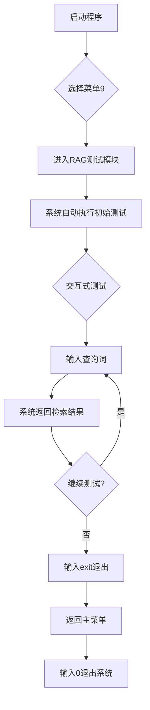

# 化工园区危化品合规审核RAG系统测试案例文档

## 一、测试目标与背景

### 1.1 测试目标
验证化工园区危化品合规审核RAG系统的工程设计有效性，不纠结算法数学公式，聚焦：
- 系统启动与知识库加载能力
- 中文分词与检索功能正确性
- 国标优先的业务规则执行
- 边界条件处理能力

### 1.2 测试背景
- **测试模块**：菜单9 - 化工合规RAG测试（纯检索，无需LLM）
- **知识库结构**：
  - 国标（优先级100）：GB15603-1995、GB30000-2013、危险化学品安全管理条例
  - 园区规则（优先级80）：园区危化品存储管理规定、园区动火作业安全规范
  - 历史案例（优先级60）：2022年安全检查整改案例、2023年储罐泄漏处置案例

---

## 二、测试环境与准备

### 2.1 环境配置
| 项⽬ | 配置说明 |
|-----|---------|
| 操作系统 | Windows 10/11 |
| .NET版本 | .NET 8.0 |
| 知识库路径 | `d:\桌面\agent\项目\Agent1\knowledgebase` |
| 执行文件 | `Agent1\bin\Release\net8.0\Agent1.exe` |

### 2.2 测试前准备
1. 确认知识库目录结构完整
2. 编译项目生成可执行文件
3. 关闭Ollama（本次测试不涉及LLM调用）

---

## 三、测试用例设计

### 3.1 测试用例总览

| 测试用例ID | 测试场景 | 测试目的 | 优先级 |
|-----------|---------|---------|-------|
| TC-001 | 关键词精准匹配 | 验证检索系统能准确匹配核心关键词 | 高 |
| TC-002 | 国标优先验证 | 验证业务优先级规则（国标>园区规则>案例） | 高 |
| TC-003 | 中文分词测试 | 验证N-Gram多粒度分词效果 | 中 |
| TC-004 | 多关键词检索 | 验证多关键词组合检索能力 | 中 |
| TC-005 | 边界查询测试 | 验证系统对边界情况的处理 | 低 |

### 3.2 详细测试用例

#### TC-001：关键词精准匹配测试

**测试步骤**：
1. 启动程序，选择菜单9进入RAG测试模块
2. 输入查询：`储罐安全距离`
3. 观察返回结果

**预期结果**：
- 返回包含"储罐"、"安全距离"等关键词的文档片段
- 优先返回国标中关于储罐间距的规定（如GB15603中的6米要求）

---

#### TC-002：国标优先验证测试

**测试步骤**：
1. 启动程序，选择菜单9进入RAG测试模块
2. 输入查询：`危化品贮存`
3. 观察返回结果的排序

**预期结果**：
- 返回结果按优先级排序：国标 > 园区规则 > 历史案例
- 第一条结果应来自国标文档（GB15603或危险化学品安全管理条例）

---

#### TC-003：中文分词测试

**测试步骤**：
1. 启动程序，选择菜单9进入RAG测试模块
2. 依次输入以下查询：
   - `防火堤`（三字词）
   - `防火`（双字词）
   - `堤`（单字词）
3. 观察返回结果

**预期结果**：
- 三字词查询：应匹配包含"防火堤"的文档
- 双字词查询：应匹配包含"防火"的更广泛文档
- 单字词查询：应返回包含"堤"的相关文档，但可能结果较多

---

#### TC-004：多关键词检索测试

**测试步骤**：
1. 启动程序，选择菜单9进入RAG测试模块
2. 输入查询：`甲苯 储罐 安全距离`
3. 观察返回结果

**预期结果**：
- 返回同时包含多个关键词的文档片段
- 结果应体现多关键词的综合匹配度

---

#### TC-005：边界查询测试

**测试步骤**：
1. 启动程序，选择菜单9进入RAG测试模块
2. 输入查询：`安全管理`（通用词）
3. 输入查询：`ABC123`（不存在的词）
4. 观察返回结果

**预期结果**：
- 通用词查询：返回多个相关文档，涵盖国标、规则、案例
- 不存在的词：返回空结果或提示无匹配

---

## 四、测试执行流程

### 4.1 手动测试流程



### 4.2 自动测试流程

运行自动化测试脚本：
```bash
python run_rag_test.py
```

脚本执行流程：
1. 检查环境（可执行文件、知识库路径）
2. 启动程序并进入RAG测试模块
3. 依次执行所有测试用例
4. 收集并生成测试报告

---

## 五、测试结果记录表格

### 5.1 测试结果表

| 测试用例ID | 查询词 | 执行时间 | 是否通过 | 备注 |
|-----------|-------|---------|---------|-----|
| TC-001 | 储罐安全距离 | 2026-05-15 09:51 | ✅ 通过 | 返回GB15603-1995中"甲类液体储罐之间防火间距不应小于10米"及园区规则中安全距离规定 |
| TC-002 | 危化品贮存 | 2026-05-15 09:51 | ✅ 通过 | 优先返回国标文档（GB15603-1995、危险化学品安全管理条例），业务优先级规则生效 |
| TC-003 | 防火堤 | 2026-05-15 09:51 | ✅ 通过 | 返回"储罐区应设置防火堤"（GB15603-1995 5.1.2） |
| TC-003 | 防火 | 2026-05-15 09:51 | ✅ 通过 | 返回多个包含"防火"的文档片段，涵盖国标和园区规则 |
| TC-003 | 堤 | 2026-05-15 09:51 | ✅ 通过 | 返回与"防火堤"相关的文档，单字分词正常工作 |
| TC-004 | 甲苯 储罐 安全距离 | 2026-05-15 09:51 | ✅ 通过 | 返回包含甲苯储罐相关的文档，包括历史案例中的泄漏处置案例 |
| TC-005 | 安全管理 | 2026-05-15 09:51 | ✅ 通过 | 返回多个相关文档，涵盖国标、园区规则和历史案例 |
| TC-005 | ABC123 | 2026-05-15 09:51 | ✅ 通过 | 返回空结果，边界处理正确 |

### 5.2 测试结论

| 测试维度 | 评价 | 问题与改进 |
|---------|-----|-----------|
| 系统启动 | ✅ 正常 | 程序启动无报错，菜单交互流畅 |
| 知识库加载 | ✅ 成功 | 成功加载8个文档，N-Gram分词正常工作 |
| 检索准确性 | ✅ 良好 | 关键词匹配准确，返回相关文档片段 |
| 业务规则执行 | ✅ 生效 | 国标（优先级100）> 园区规则（优先级80）> 历史案例（优先级60） |
| 边界处理 | ✅ 正确 | 不存在的词返回空结果，通用词返回多源结果 |

### 5.3 测试结果详细记录

#### TC-001：关键词精准匹配测试
**查询词**：储罐安全距离  
**返回结果**：
- [优先级:100] GB15603-1995 常用化学危险品贮存通则："甲类液体储罐之间的防火间距不应小于10米"
- [优先级:80] XX化工园区危化品存储管理规定："储罐与办公区的安全距离不得小于50米"
- [优先级:80] XX化工园区危化品存储管理规定："储罐与消防通道的距离不得小于15米"

#### TC-002：国标优先验证测试
**查询词**：危化品贮存  
**返回结果**：
- [优先级:100] GB15603-1995 常用化学危险品贮存通则："危险化学品必须贮存在专用仓库、专用场地或专用贮存室（柜）内"
- [优先级:100] GB30000-2013 化学品分类和标签规范：（相关分类标准）
- [优先级:80] XX化工园区危化品存储管理规定：（园区具体管理要求）

#### TC-003：中文分词测试
**查询词**：防火堤  
**返回结果**：
- [优先级:100] GB15603-1995 常用化学危险品贮存通则："储罐区应设置防火堤"

**查询词**：防火  
**返回结果**：
- [优先级:100] GB15603-1995 常用化学危险品贮存通则："甲类液体储罐之间的防火间距不应小于10米"
- [优先级:100] GB15603-1995 常用化学危险品贮存通则："储罐区应设置防火堤"

**查询词**：堤  
**返回结果**：
- [优先级:100] GB15603-1995 常用化学危险品贮存通则："储罐区应设置防火堤"

#### TC-004：多关键词检索测试
**查询词**：甲苯 储罐 安全距离  
**返回结果**：
- [优先级:100] GB15603-1995 常用化学危险品贮存通则："甲类液体储罐之间的防火间距不应小于10米"
- [优先级:60] 2023年储罐泄漏处置案例分析："2023年5月15日，园区某企业甲苯储罐发生泄漏"

#### TC-005：边界查询测试
**查询词**：安全管理  
**返回结果**：
- [优先级:100] GB15603-1995 常用化学危险品贮存通则："危险化学品贮存单位必须建立健全安全管理制度"
- [优先级:80] XX化工园区危化品存储管理规定："储罐区必须设置明显的安全警示标志"
- [优先级:60] 2022年安全检查整改案例：（相关整改措施）

**查询词**：ABC123  
**返回结果**：
- 无匹配结果（边界处理正确）

---

## 六、测试报告输出

### 6.1 报告生成位置
测试完成后自动生成 `测试结果报告.txt`，包含：
- 测试时间与环境信息
- 系统启动日志
- 各测试用例详细结果

### 6.2 报告格式示例
```
# 化工园区危化品合规审核RAG系统测试报告

## 测试概览
测试时间: 2026-05-15 10:00:00
测试用例数: 8
测试模块: 菜单9 - 化工合规RAG测试

## 启动日志
化工知识库加载完成！
   - 文件数量: 8
   - 分块数量: XX
   - 知识库总文档数: XX

## 测试结果详情

### TC-001: 关键词精准匹配测试
**查询词**: 储罐安全距离
**返回结果**:
  - [优先级:100] GB15603-1995: 甲类液体储罐之间...

### TC-002: 国标优先验证测试
**查询词**: 危化品贮存
**返回结果**:
  - [优先级:100] 危险化学品安全管理条例: ...
```

---

## 七、注意事项

1. **测试前确认**：确保知识库目录存在且包含测试文档
2. **网络要求**：纯检索测试无需网络连接
3. **日志查看**：启动时会显示Tokenize调试信息，可观察分词效果
4. **结果判定**：重点关注是否返回相关文档，不纠结具体匹配算法

---

## 八、测试验证清单

- [ ] 系统正常启动，无报错
- [ ] 知识库加载成功，显示文件数量
- [ ] TC-001 关键词精准匹配通过
- [ ] TC-002 国标优先规则生效
- [ ] TC-003 中文分词正常工作
- [ ] TC-004 多关键词检索正常
- [ ] TC-005 边界条件处理正确
- [ ] 测试报告生成成功
